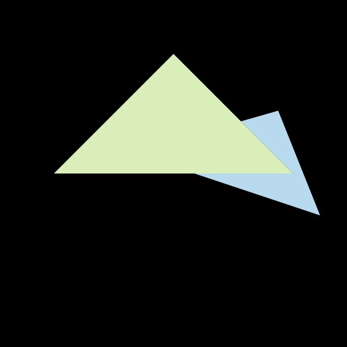

结果图：




不进行超采样的代码：

```cpp
// rasterzer.cpp

// clang-format off
//
// Created by goksu on 4/6/19.
//

#include <algorithm>
#include <vector>
#include "rasterizer.hpp"
#include <opencv2/opencv.hpp>
#include <math.h>


rst::pos_buf_id rst::rasterizer::load_positions(const std::vector<Eigen::Vector3f> &positions)
{
    auto id = get_next_id();
    pos_buf.emplace(id, positions);

    return {id};
}

rst::ind_buf_id rst::rasterizer::load_indices(const std::vector<Eigen::Vector3i> &indices)
{
    auto id = get_next_id();
    ind_buf.emplace(id, indices);

    return {id};
}

rst::col_buf_id rst::rasterizer::load_colors(const std::vector<Eigen::Vector3f> &cols)
{
    auto id = get_next_id();
    col_buf.emplace(id, cols);

    return {id};
}

auto to_vec4(const Eigen::Vector3f& v3, float w = 1.0f)
{
    return Vector4f(v3.x(), v3.y(), v3.z(), w);
}


static bool insideTriangle(int x, int y, const Vector3f* _v)
{   
    // TODO : Implement this function to check if the point (x, y) is inside the triangle represented by _v[0], _v[1], _v[2]
    Eigen::Vector3f v1(x-_v[0].x(), y-_v[0].y(), 0), 
        v2(x-_v[1].x(), y-_v[1].y(), 0), 
        v3(x-_v[2].x(), y-_v[2].y(), 0), 
        w1(_v[1].x() - _v[0].x(), _v[1].y() - _v[0].y(), 0), 
        w2(_v[2].x() - _v[1].x(), _v[2].y() - _v[1].y(), 0), 
        w3(_v[0].x() - _v[2].x(), _v[0].y() - _v[2].y(), 0);
    float f1 = v1.cross(w1).z(), f2 = v2.cross(w2).z(), f3 = v3.cross(w3).z();
    return f1>0 && f2>0 && f3>0 || f1<0 && f2<0 && f3<0;
}

// 计算二维的重心坐标
static std::tuple<float, float, float> computeBarycentric2D(float x, float y, const Vector3f* v)
{
    float c1 = (x*(v[1].y() - v[2].y()) + (v[2].x() - v[1].x())*y + v[1].x()*v[2].y() - v[2].x()*v[1].y()) / (v[0].x()*(v[1].y() - v[2].y()) + (v[2].x() - v[1].x())*v[0].y() + v[1].x()*v[2].y() - v[2].x()*v[1].y());
    float c2 = (x*(v[2].y() - v[0].y()) + (v[0].x() - v[2].x())*y + v[2].x()*v[0].y() - v[0].x()*v[2].y()) / (v[1].x()*(v[2].y() - v[0].y()) + (v[0].x() - v[2].x())*v[1].y() + v[2].x()*v[0].y() - v[0].x()*v[2].y());
    float c3 = (x*(v[0].y() - v[1].y()) + (v[1].x() - v[0].x())*y + v[0].x()*v[1].y() - v[1].x()*v[0].y()) / (v[2].x()*(v[0].y() - v[1].y()) + (v[1].x() - v[0].x())*v[2].y() + v[0].x()*v[1].y() - v[1].x()*v[0].y());
    return {c1,c2,c3};
}

void rst::rasterizer::draw(pos_buf_id pos_buffer, ind_buf_id ind_buffer, col_buf_id col_buffer, Primitive type)
{
    auto& buf = pos_buf[pos_buffer.pos_id];
    auto& ind = ind_buf[ind_buffer.ind_id];
    auto& col = col_buf[col_buffer.col_id];

    float f1 = (50 - 0.1) / 2.0;
    float f2 = (50 + 0.1) / 2.0;

    Eigen::Matrix4f mvp = projection * view * model;
    // 对于所有的三角形
    for (auto& i : ind)
    {
        Triangle t;
        // 三角形三个顶点的齐次坐标
        Eigen::Vector4f v[] = {
                mvp * to_vec4(buf[i[0]], 1.0f),
                mvp * to_vec4(buf[i[1]], 1.0f),
                mvp * to_vec4(buf[i[2]], 1.0f)
        };
        //Homogeneous division
        // 透视除法，将原来的齐次坐标转换为笛卡尔坐标(4维坐标变回3维坐标)
        // w()函数可以得到向量中第四个分量的值
        for (auto& vec : v) {
            vec /= vec.w();
        }
        //Viewport transformation
        // 视口变化，[-1,1]^2的平面映射成屏幕平面[0,width]*[0,height]
        for (auto & vert : v)
        {
            vert.x() = 0.5*width*(vert.x()+1.0);
            vert.y() = 0.5*height*(vert.y()+1.0);
            // 经过视口变换后，z的范围为[-1,1]
            vert.z() = vert.z() * f1 + f2;  // 注意：这里的作用是将z值从原来的负数转变为正数
        }

        // 设置三角形的三个顶点
        for (int i = 0; i < 3; ++i)
        {
            t.setVertex(i, v[i].head<3>());
        }

        // 取出三个顶点的颜色
        auto col_x = col[i[0]];
        auto col_y = col[i[1]];
        auto col_z = col[i[2]];

        // 设置三个顶点的颜色
        t.setColor(0, col_x[0], col_x[1], col_x[2]);
        t.setColor(1, col_y[0], col_y[1], col_y[2]);
        t.setColor(2, col_z[0], col_z[1], col_z[2]);

        rasterize_triangle(t);
    }
}

//Screen space rasterization
void rst::rasterizer::rasterize_triangle(const Triangle& t) {
    auto v = t.toVector4();
    
    // TODO:找出当前三角形的边界框(bunding box)。
    // 遍历像素并查找当前像素是否在三角形内
    std::initializer_list<float> listx = {t.v[0].x(), t.v[1].x(), t.v[2].x()},
        listy = {t.v[0].y(), t.v[1].y(), t.v[2].y()};
    // 直接向下取整
    int minx = std::min(listx) , 
        maxx = std::max(listx), 
        miny = std::min(listy), maxy = std::max(listy);
    
    for(int x=minx; x<=maxx; x++) {
        for(int y=miny; y<=maxy; y++) {
            if(insideTriangle(x, y, t.v)) {
                // 如果是，请使用以下代码获取插值的z值。
                auto[alpha, beta, gamma] = computeBarycentric2D(x, y, t.v);
                float w_reciprocal = 1.0/(alpha / v[0].w() + beta / v[1].w() + gamma / v[2].w());
                float z_interpolated = alpha * v[0].z() / v[0].w() + beta * v[1].z() / v[1].w() + gamma * v[2].z() / v[2].w();
                z_interpolated *= w_reciprocal;
                assert(z_interpolated > 0);
                // TODO:如果应该绘制三角形，则将当前像素（使用set_pixel函数）设置为三角形的颜色（使用getColor函数）。
                // 先判断深度缓冲
                // 注意：之前在视口变换的时候对顶点的z值做了vert.z() = vert.z() * f1 + f2;的处理
                // 使得z值一定是正数，然后如果z值越小，那么离相机越远；z值越大，离相机越近
                // 深度缓冲depth_buf初始值为无穷大，所以这里将z值取负，那么z值越小，离相机越近
                if(-z_interpolated < depth_buf[(height-1-y)*width + x]) {
                    assert((height-1-y)*width + x < width*height);
                    depth_buf[(height-1-y)*width + x] = -z_interpolated;
                    set_pixel({x,y,z_interpolated}, t.getColor());
                }

            }
        }
    }

    

    
}

void rst::rasterizer::set_model(const Eigen::Matrix4f& m)
{
    model = m;
}

void rst::rasterizer::set_view(const Eigen::Matrix4f& v)
{
    view = v;
}

void rst::rasterizer::set_projection(const Eigen::Matrix4f& p)
{
    projection = p;
}

void rst::rasterizer::clear(rst::Buffers buff)
{
    if ((buff & rst::Buffers::Color) == rst::Buffers::Color)
    {
        std::fill(frame_buf.begin(), frame_buf.end(), Eigen::Vector3f{0, 0, 0});
    }
    if ((buff & rst::Buffers::Depth) == rst::Buffers::Depth)
    {
        std::fill(depth_buf.begin(), depth_buf.end(), std::numeric_limits<float>::infinity());
    }
}

rst::rasterizer::rasterizer(int w, int h) : width(w), height(h)
{
    frame_buf.resize(w * h);
    depth_buf.resize(w * h);
}

int rst::rasterizer::get_index(int x, int y)
{
    return (height-1-y)*width + x;
}

void rst::rasterizer::set_pixel(const Eigen::Vector3f& point, const Eigen::Vector3f& color)
{
    //old index: auto ind = point.y() + point.x() * width;
    auto ind = (height-1-point.y())*width + point.x();
    frame_buf[ind] = color;

}

// clang-format on
```

代码编写注意：
* vscode需要在`c_cpp_properties.json`中设置开启c++17
* `shift + Ctrl + p `打开搜索，然后搜索`C/C++`编辑配置
