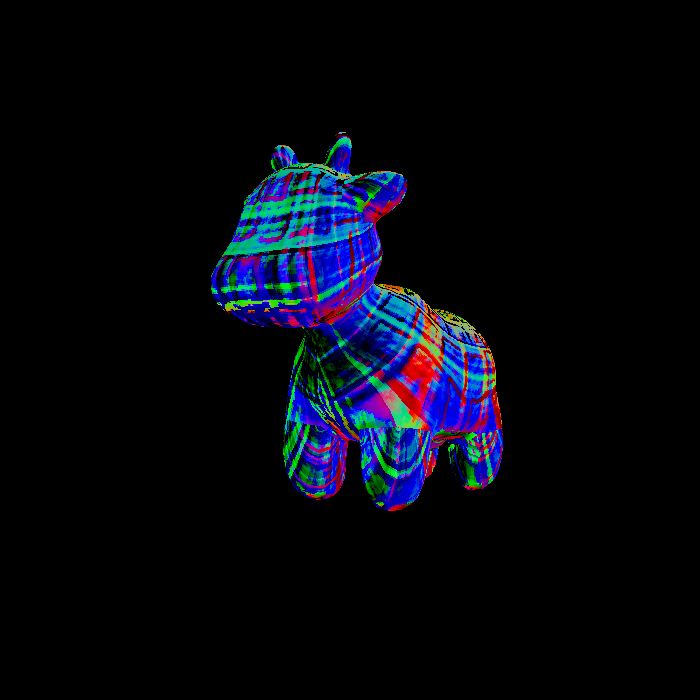

## 踩坑说明

* 三角形的边界没有取满
* 可以看到下面的代码在遍历像素的时候，忘记取到边界了！
* 应该写成`i<=maxx`
```cpp
// rst::rasterizer::rasterize_triangle
    for(int i=minx;i<maxx;i++) {
        for(int j=miny;j<maxy;j++) {
            ...
        }
    }
```


* `dU = kh * kn * (h(u+1/w,v)-h(u,v))`中的`u + 1/w`写成了`(u+1)/w`



正确图片如下：


## 未反走样代码

```cpp
//Screen space rasterization
// t为经过mvp变换后的三角形
// view_pos是只经过mv变换的三角形顶点
void rst::rasterizer::rasterize_triangle(const Triangle& t, const std::array<Eigen::Vector3f, 3>& view_pos) 
{
    // TODO: From your HW3, get the triangle rasterization code.
    const Vector4f* v = t.v;
    std::initializer_list<float> listx = {v[0].x(), v[1].x(), v[2].x()},
        listy = {v[0].y(), v[1].y(), v[2].y()};
    int minx = min(listx), maxx = max(listx),
        miny = min(listy), maxy = max(listy);
    for(int i=minx;i<=maxx;i++) {
        for(int j=miny;j<=maxy;j++) {
            float posx = i + 0.5, posy = j + 0.5;
            if(insideTriangle(posx, posy, v)) {
                // 计算深度的插值，深度越大，离相机越近
                auto[alpha, beta, gamma] = computeBarycentric2D(posx, posy, v);
                float Z = 1.0 / (alpha / v[0].w() + beta / v[1].w() + gamma / v[2].w());
                float zp = alpha * v[0].z() / v[0].w() + beta * v[1].z() / v[1].w() + gamma * v[2].z() / v[2].w();
                zp *= Z;

                // 根据深度缓冲，判断是否更新
                // 因为深度的初始值为std::numeric_limits<float>::infinity()，所以这里进行转换，深度越小越近
                // 那么将z值取负
                int index = get_index(posx, posy);
                if(-zp < depth_buf[index]) {
                    float weight = alpha + beta + gamma;
                    auto interpolated_color = interpolate(alpha, beta, gamma, t.color[0], t.color[1], t.color[2], weight);// 显然alpha+beta+gamma的值为1，所以weight为1
                    auto interpolated_normal = interpolate(alpha, beta, gamma, t.normal[0], t.normal[1], t.normal[2], 1);
                    auto interpolated_texcoords = interpolate(alpha, beta, gamma, t.tex_coords[0], t.tex_coords[1], t.tex_coords[2], weight);
                    // 像素在相机空间的位置，用于计算光照
                    auto interpolated_shadingcoords = interpolate(alpha, beta, gamma, view_pos[0], view_pos[1], view_pos[2], weight);

                    fragment_shader_payload payload( interpolated_color, interpolated_normal.normalized(), interpolated_texcoords, texture ? &*texture : nullptr);
                    payload.view_pos = interpolated_shadingcoords;
                    // Instead of passing the triangle's color directly to the frame buffer, pass the color to the shaders first to get the final color;
                    auto pixel_color = fragment_shader(payload);  // 通过着色器得到最终颜色
                    Eigen::Vector2i point = {(int)posx, (int)posy};
                    set_pixel(point, pixel_color);
                    depth_buf[index] = -zp;
                }
            }
            
        }
    }

}

```